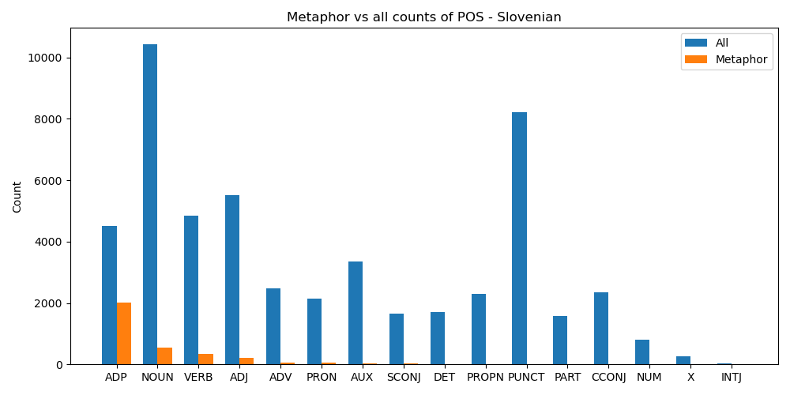
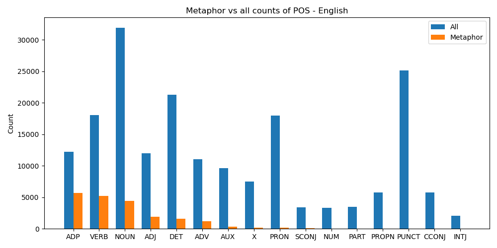
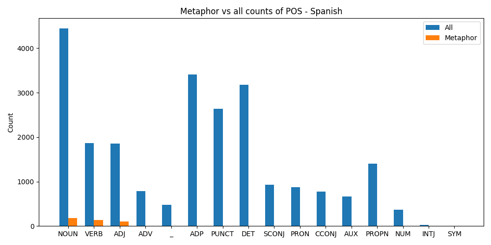
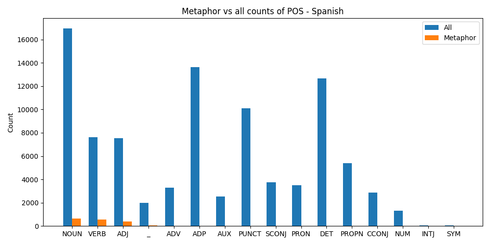
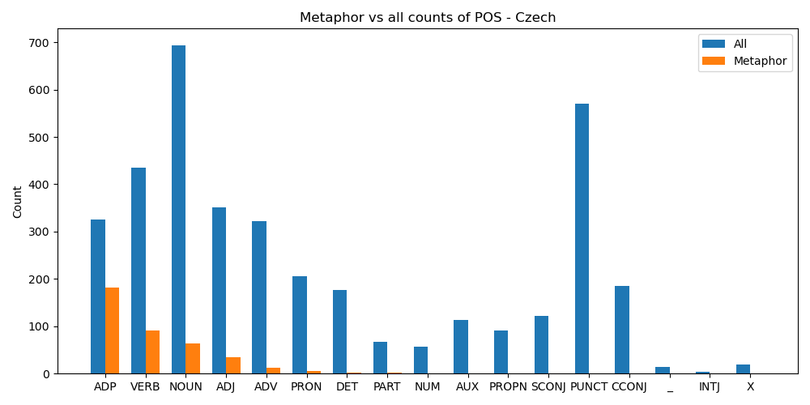

## Slovenian

`0.062240025242322444%` of metaphors

259881 words, 16175 metaphors

- 13963 sentences:
    - shortest sentence: 1
    - longest sentence: 136
    - mean length: 18.612117739740743
    - median length: 16.0

- sentences with metaphor: 6141

- most common sentence structure:
    - [(('NUM',), 109), (('NOUN',), 49), (('ADJ', 'NOUN'), 41), (('PUNCT', 'NOUN', 'NUM', 'PUNCT'), 34), (('NOUN', 'PUNCT'), 22)]

- 16175 metaphors in the dataset:
    - min metaphors in sentence: 0
    - max metaphors in sentence: 31
    - mean metaphors in sentence: 1.1584186779345413
    - median metaphors in sentence: 0.0

most common metaphorical words:
- [('v', 1822), ('na', 1456), ('za', 1354), ('z', 903), ('s', 666), ('pri', 406), ('po', 398), ('od', 359), ('med', 327), ('do', 248)]

most common metaphorical POS:
- [('ADP', 9841), ('NOUN', 2514), ('VERB', 1699), ('ADJ', 959), ('ADV', 309), ('PRON', 307), ('DET', 113), ('SCONJ', 112), ('AUX', 97), ('PROPN', 72)]

most common POS in dataset:
- [('NOUN', 51861), ('PUNCT', 41151), ('ADJ', 26992), ('VERB', 24693), ('ADP', 22730), ('AUX', 16830), ('ADV', 12296), ('CCONJ', 11829), ('PROPN', 11178), ('PRON', 10464)]   

## English

`0.10911412999953635%` of metaphors

237247 words, 25887 metaphors

- 16202 sentences:
    - shortest sentence: 0
    - longest sentence: 115
    - mean length: 14.643068756943586
    - median length: 10.0

- sentences with metaphor: 8220

- most common sentence structure:
    - [(('INTJ', 'PUNCT'), 928), (('ADV', 'PUNCT'), 145), (('NOUN', 'PUNCT'), 81), (('INTJ',), 77), (('NUM', 'PUNCT'), 75)]

- 25887 metaphors in the dataset:
    - min metaphors in sentence: 0
    - max metaphors in sentence: 28
    - mean metaphors in sentence: 1.5977657079372918
    - median metaphors in sentence: 1.0

most common metaphorical words:
- [('in', 1722), ('to', 1016), ('on', 860), ('with', 810), ('that', 736), ('this', 536), ('at', 427), ('from', 394), ('about', 384), ('have', 254)]

most common metaphorical POS:
- [('ADP', 7041), ('VERB', 6494), ('NOUN', 5489), ('ADJ', 2430), ('DET', 1920), ('ADV', 1483), ('AUX', 397), ('X', 225), ('PRON', 170), ('SCONJ', 122)]

most common POS in dataset:
- [('NOUN', 39667), ('PUNCT', 31541), ('DET', 26413), ('VERB', 22542), ('PRON', 22308), ('ADP', 15180), ('ADJ', 14959), ('ADV', 13786), ('AUX', 11923), ('X', 9366)]

## Spanish WHOLE

`0.01832854602653536%` of metaphors

116976 words, 2144 metaphors

- 3631 sentences:
    - shortest sentence: 1
    - longest sentence: 229
    - mean length: 32.21591847975764
    - median length: 30.0

- sentences with metaphor: 1266

- most common sentence structure:
    - [(('ADV', 'PUNCT'), 9), (('NOUN', 'PUNCT'), 7), (('PRON', 'NOUN', 'PUNCT'), 7), (('ADJ', 'NOUN', 'PUNCT'), 6), (('INTJ', 'PUNCT'), 6)]

- 2144 metaphors in the dataset:
    - min metaphors in sentence: 0
    - max metaphors in sentence: 11
    - mean metaphors in sentence: 0.5904709446433489
    - median metaphors in sentence: 0.0

most common metaphorical words:
- [('marco', 29), ('ola', 21), ('grandes', 19), ('fuerzas', 18), ('crecimiento', 17), ('camino', 15), ('escenario', 12), ('paso', 12), ('desescalada', 12), ('claro', 10)]    

most common metaphorical POS:
- [('NOUN', 844), ('VERB', 712), ('ADJ', 511), ('_', 43), ('ADV', 25), ('ADP', 7), ('AUX', 2)]

most common POS in dataset:
- [('NOUN', 21425), ('ADP', 17043), ('DET', 15863), ('PUNCT', 12729), ('VERB', 9487), ('ADJ', 9409), ('PROPN', 6803), ('SCONJ', 4664), ('PRON', 4372), ('ADV', 4083)]

## Spanish TEST

`0.018187188792303147%` of metaphors

23698 words, 431 metaphors

- 726 sentences:
    - shortest sentence: 2
    - longest sentence: 229
    - mean length: 32.641873278236915
    - median length: 30.0

- sentences with metaphor: 251

- most common sentence structure:
    - [(('NOUN', 'PUNCT'), 3), (('PRON', 'NOUN', 'PUNCT'), 3), (('ADJ', 'NOUN', 'PUNCT'), 2), (('ADP', 'DET', 'NOUN', 'PUNCT'), 2), (('INTJ', 'PUNCT'), 2)]

- 431 metaphors in the dataset:
    - min metaphors in sentence: 0
    - max metaphors in sentence: 11
    - mean metaphors in sentence: 0.59366391184573
    - median metaphors in sentence: 0.0

most common metaphorical words:
- [('marco', 8), ('ola', 6), ('escenario', 5), ('estabilidad', 5), ('caída', 4), ('abrir', 4), ('crecimiento', 4), ('paso', 4), ('camino', 
4), ('avanzado', 4)]

most common metaphorical POS:
- [('NOUN', 181), ('VERB', 139), ('ADJ', 101), ('_', 4), ('ADV', 4), ('ADP', 2)]

most common POS in dataset:
- [('NOUN', 4450), ('ADP', 3408), ('DET', 3182), ('PUNCT', 2640), ('VERB', 1867), ('ADJ', 1853), ('PROPN', 1401), ('SCONJ', 929), ('PRON', 
872), ('ADV', 785)]

## Spanish TRAIN

`0.018364458929222324%` of metaphors

93278 words, 1713 metaphors

- 2905 sentences:
    - shortest sentence: 1
    - longest sentence: 202
    - mean length: 32.10946643717728
    - median length: 29.0

- sentences with metaphor: 1015

- most common sentence structure:
    - [(('ADV', 'PUNCT'), 8), (('NOUN', 'ADP', 'PROPN', 'ADP', 'NOUN', 'PUNCT'), 4), (('PRON', 'NOUN', 'PUNCT'), 4), (('INTJ', 'PUNCT'), 4), (('NOUN', 'PUNCT'), 4)]

- 1713 metaphors in the dataset:
    - min metaphors in sentence: 0
    - max metaphors in sentence: 11
    - mean metaphors in sentence: 0.5896729776247849
    - median metaphors in sentence: 0.0

most common metaphorical words:
- [('marco', 21), ('fuerzas', 16), ('grandes', 16), ('ola', 15), ('crecimiento', 13), ('desescalada', 12), ('camino', 11), ('claro', 9), ('frenar', 8), ('lucha', 8)]

most common metaphorical POS:
- [('NOUN', 663), ('VERB', 573), ('ADJ', 410), ('_', 39), ('ADV', 21), ('ADP', 5), ('AUX', 2)]

most common POS in dataset:
- [('NOUN', 16975), ('ADP', 13635), ('DET', 12681), ('PUNCT', 10089), ('VERB', 7620), ('ADJ', 7556), ('PROPN', 5402), ('SCONJ', 3735), ('PRON', 3500), ('ADV', 3298)]

## Czech

`0.10538742219360378%` of metaphors

4659 words, 491 metaphors

- 236 sentences:
    - shortest sentence: 2
    - longest sentence: 104
    - mean length: 19.741525423728813
    - median length: 18.0

- sentences with metaphor: 169

- most common sentence structure:
    - [(('NOUN', 'ADP', 'NOUN', 'PUNCT'), 3), (('ADJ', 'NOUN', 'PUNCT'), 2), (('SCONJ', 'ADP', 'NOUN', 'VERB', 'ADV', 'PUNCT', 'AUX', 'ADV', 'NOUN', 'PUNCT'), 1), (('ADP', 'NOUN', 'ADJ', 'NOUN', 'VERB', 'NUM', 'NOUN', 'ADP', 'ADJ', 'ADJ', 'NOUN', 'ADJ', 'NOUN', 'PUNCT', 'NOUN', 'ADP', 'ADJ', 'NOUN', 'VERB', 'ADP', 'NOUN', 'ADP', 'NOUN', 'PUNCT', 
'ADV', 'VERB', 'PUNCT'), 1), (('NOUN', 'ADV', 'ADV', 'VERB', 'PUNCT', 'CCONJ', 'ADP', 'ADJ', 'NOUN', 'AUX', 'ADV', 'ADV', 'PUNCT', 'VERB', 'ADV', 'NOUN', 'CCONJ', 'ADP', 'ADJ', 'ADJ', 'NOUN', 'VERB', 'ADJ', 'NOUN', 'NOUN', 'ADP', 'ADJ', 'PUNCT', 'ADJ', 'NOUN', 'PUNCT', 'DET', 'PRON', 'ADJ', 'NOUN', 'VERB', 'VERB', 'PUNCT'), 1)]

- 491 metaphors in the dataset:
    - min metaphors in sentence: 0
    - max metaphors in sentence: 18
    - mean metaphors in sentence: 2.080508474576271
    - median metaphors in sentence: 1.0

most common metaphorical words:
- [('na', 40), ('v', 34), ('k', 23), ('do', 13), ('s', 12), ('od', 10), ('o', 10), ('z', 9), ('za', 9), ('se', 9)]

most common metaphorical POS:
- [('ADP', 222), ('VERB', 124), ('NOUN', 76), ('ADJ', 39), ('ADV', 12), ('PRON', 9), ('DET', 2), ('PART', 2), ('AUX', 2), ('SCONJ', 1)]

most common POS in dataset:
- [('NOUN', 874), ('PUNCT', 700), ('VERB', 546), ('ADJ', 453), ('ADP', 404), ('ADV', 379), ('PRON', 256), ('CCONJ', 233), ('DET', 217), ('SCONJ', 149)]

